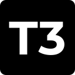

<p align="center">
  
</p>

<h1 align="center">RUNE</h1>

<p align="center">
  Build in the environment you already use. Change the intelligence when you want.
</p>

<p align="center">
  <a href="#quick-start">Quick start</a> ·
  <a href="./docs/user/install.md">Install guide</a> ·
  <a href="./docs/internals/overview.md">Architecture</a> ·
  <a href="./CONTRIBUTING.md">Contributing</a>
</p>

RUNE is an open-source, AI-native development environment for real projects. Open a workspace, tell an agent what to build, inspect the changes, run the project, and keep working from the same place.

Use the coding agent you already have installed—or, with the experimental Alpha Harness, connect a model directly and let RUNE provide the workspace tools around it.

## One workspace, different kinds of intelligence

Most AI coding tools make you choose between their editor, their model, and their workflow. RUNE is built around a simpler idea: your project environment should remain useful even when the agent or model changes.

There are two ways to work:

### Bring an existing agent

RUNE runs and controls provider CLIs on the machine that owns the project. Your existing Codex, Claude Code, Cursor, Grok Build, OpenCode, or Antigravity setup keeps its provider-specific behavior while RUNE gives it a shared workspace, conversation, terminal, Git, diff, checkpoint, and remote-control experience.

### Choose a model through RUNE

The Alpha Harness is RUNE's native agent loop. You configure a model service such as OpenRouter or the OpenAI API, choose a model, and RUNE supplies a bounded set of workspace tools. The model can inspect files, search the project, make approved edits, run focused checks, and continue from the results.

OpenRouter is a connection to paid third-party model APIs—not a free or unlimited model plan. Your API key, model access, context, and charges remain subject to the service you choose.

```text
Existing agent path                  Alpha Harness path
Your CLI + its native tools          Your API model + RUNE tools
              \                       /
               RUNE workspace, state, Git, terminal,
               checkpoints, permissions, and clients
```

## The part that feels like an IDE

RUNE keeps the agent in the loop with the things that determine whether a change is actually useful:

- Work in named projects and worktrees instead of an unstructured chat transcript.
- Browse and search the real workspace, including hidden and ignored paths where appropriate.
- Open files, edit in context, and inspect turn-level or thread-level diffs.
- Run terminals and project commands on the server that owns the workspace.
- Use Git operations, branches, checkpoints, reverts, remotes, and pull-request workflows.
- See provider activity, approvals, model selection, usage, and session state as they happen.
- Continue from the web or desktop client, including a remote environment reached over LAN, Tailscale, HTTPS, or SSH.

The point is not to hide the work behind a chat bubble. It is to make the path from idea to verified change visible.

## Built for real projects

RUNE has been reworked in places where an agent environment has to be dependable:

- **Workspace discovery is filesystem-aware.** Directory browsing uses directory-entry types, and dot-prefixed directories such as `.temp` are handled as directories rather than being misclassified as files. Tests cover both normal directory browsing and hidden-prefix completion.
- **Search and loading have dedicated paths.** The file tree walks the workspace directly so it can render without waiting for a full index; indexed search handles path and content queries; large provider transcripts are streamed and cached instead of repeatedly materializing everything in memory.
- **Streaming is scoped.** Clients subscribe to typed RPC streams for the data they need instead of receiving one broad push bus. The shared client runtime owns connection lifecycle, cached environment data, and state so web and mobile do not each reinvent transport behavior.
- **Changes are recoverable.** Turns are bracketed by Git-backed checkpoints, and the server projects commands and events through an event-sourced orchestration engine. A diff is an inspectable state transition, not just a sentence from the model.
- **Providers are adapters, not special cases.** A registry resolves provider instances and adapters behind one service boundary. Provider-specific process protocols stay at the edge while projects, sessions, approvals, and client streams use shared contracts.
- **The native loop is bounded.** Alpha Harness tool output is clamped, batched operations have limits, request budgets cap round trips, mutations require approval, and verification evidence is invalidated after a later mutation.

These are engineering properties, not performance promises with invented benchmarks. RUNE is still early software and some surfaces remain experimental.

## Platform status

- **Web:** active. Run locally or connect to a remote RUNE server.
- **Desktop:** active Electron application for macOS, Windows, and Linux release targets.
- **Mobile:** in development and not distributed as an official iOS or Android app yet.

Do not use upstream mobile-store links or package identifiers as RUNE downloads. The current source tree does not establish an official mobile release URL.

## Quick start

### Try the server and web client

The server requires Node.js `^22.16 || ^23.11 || >=24.10`.

```bash
npx rune@latest
```

This starts the RUNE server and opens the local web client. Run `npx rune@latest --help` for the CLI reference.

### Use the desktop app

Desktop artifacts are built and published through this repository's release workflow. When a RUNE release is available, use the repository's [Releases page](https://github.com/bitreonx/rune/releases). Source builds and platform packaging commands are documented in [CONTRIBUTING.md](./CONTRIBUTING.md) and the internal docs.

### Connect a provider CLI

Install and authenticate the provider on the machine that runs the RUNE server:

| Agent        | Binary RUNE detects | Authentication        |
| ------------ | ------------------- | --------------------- |
| Codex        | `codex`             | `codex login`         |
| Claude Code  | `claude`            | `claude auth login`   |
| Antigravity  | `agy`               | Run `agy` and sign in |
| Cursor Agent | `cursor-agent`      | `agent login`         |
| Grok Build   | `grok`              | `grok login`          |
| OpenCode     | `opencode`          | `opencode auth login` |

Codex, Claude Code, and Antigravity are enabled by default. Cursor, Grok Build, and OpenCode can be enabled from provider settings. If a binary is not on the server's `PATH`, set its explicit path in provider settings.

Provider credentials and model access remain with the provider. RUNE does not ship these CLIs or their subscriptions.

## Developing RUNE

RUNE is a pnpm workspace using Vite+ (`vp`). The repository requires Node.js 24.13.1 for the root toolchain.

```bash
vp i
vp run dev
```

Useful focused commands:

```bash
vp run dev:server
vp run dev:web
vp run dev:desktop
vp test run <files-you-touched>
vp run --filter @rune/web typecheck
vp run --filter rune typecheck
```

See [CONTRIBUTING.md](./CONTRIBUTING.md) before making changes. CI owns the repository-wide checks; local verification should stay focused.

## Security and data flow

The RUNE server is the execution boundary. Provider processes, terminals, Git operations, filesystem reads, and Alpha Harness tools run on the server that owns the environment; web and mobile clients connect through authenticated RPC.

RUNE has per-thread permission modes and provider approval requests. Alpha Harness read tools run against RUNE's workspace services, while file changes, patches, generated files, shell commands, and focused checks are approval-gated. Remote pairing credentials should be treated like passwords and revoked when no longer trusted.

When you use a hosted provider or OpenRouter, the relevant prompt, workspace context, and tool observations are sent to that external service so it can answer. RUNE does not claim that external model providers never receive your code. Review provider policies and use a permission mode appropriate for the environment.

## Where the code lives

| Area                                                     | Source                                                 |
| -------------------------------------------------------- | ------------------------------------------------------ |
| Server, sessions, providers, terminals, Git, checkpoints | [`apps/server`](./apps/server)                         |
| Web client and editor surfaces                           | [`apps/web`](./apps/web)                               |
| Electron shell, previews, SSH, packaging                 | [`apps/desktop`](./apps/desktop)                       |
| Mobile client and native modules (development)           | [`apps/mobile`](./apps/mobile)                         |
| Shared wire contracts                                    | [`packages/contracts`](./packages/contracts)           |
| Shared client state and runtime                          | [`packages/client-runtime`](./packages/client-runtime) |
| Remote relay infrastructure                              | [`infra/relay`](./infra/relay)                         |
| Maintainer architecture notes                            | [`docs/internals`](./docs/internals)                   |

The architecture overview explains the server-owned model, typed WebSocket RPC, event-sourced orchestration, provider registry, checkpointing, and drainable workers: [`docs/internals/overview.md`](./docs/internals/overview.md).

## Current direction

RUNE is moving toward a complete AI-native development environment: one project surface that can host existing agents, direct model routes, local and remote environments, and increasingly rich verification workflows. The Alpha Harness and mobile client are active development areas, so their contracts and UI may change.

## Attribution

RUNE is derived directly from T3 Code and contains independent modifications. It is not affiliated with or endorsed by T3 Tools Inc. or Theo Browne. See [`NOTICE.md`](./NOTICE.md), [`LICENSE`](./LICENSE), and [`RUNE_UPSTREAM_AUDIT.md`](./RUNE_UPSTREAM_AUDIT.md).
