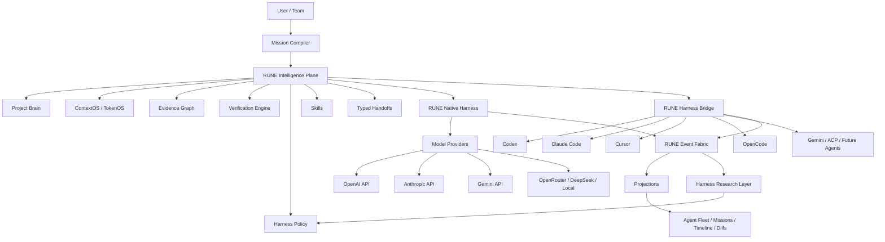
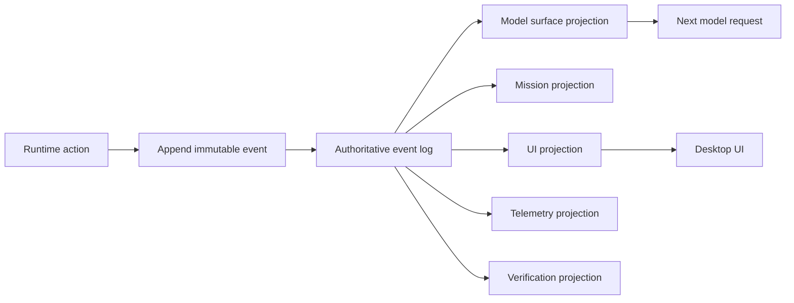
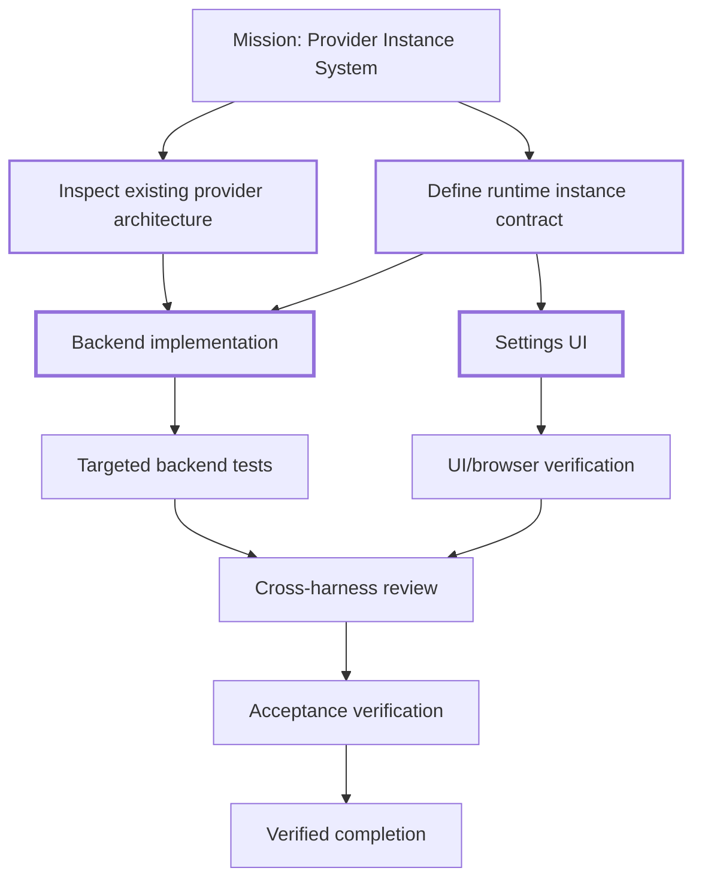
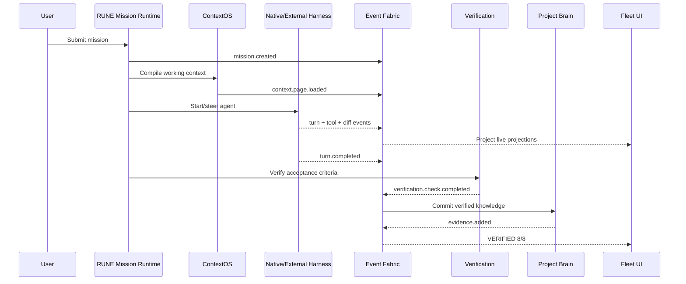

# RUNE Native and RUNE Harness Bridge: Research Blueprint for a Universal Agent Intelligence OS

## Executive summary

The central design decision is now clear:

> **RUNE must be two products sharing one intelligence substrate:**
>
> **RUNE Native** is a first-class coding harness for raw model/API providers.
>
> **RUNE Harness Bridge** augments Codex, Claude Code, Cursor, OpenCode, Gemini/ACP, and future harnesses without replacing the intelligence they already have.

That distinction is essential. DeepSeek Harness is impressive precisely because it is not mostly a prompt wrapper: its concrete agent loop is intentionally small, while sessions, tools, persistence, compaction, token metering, subagents, jobs, prompts, model adapters, projections and diagnostics sit behind explicit capability boundaries. Its session is an append-only event-sourced truth from which model-visible history is projected, its Code Mode lets a model compose several operations into one executable program, its compaction preserves raw history while replacing only the model-visible surface, and its runtime invariants/test infrastructure attempt to enforce architectural contracts instead of relying on convention. citeturn14search2turn13search3turn7search2turn7search7turn14search0

DeepSeek Harness itself explicitly describes the repository as pre-release/developer-preview infrastructure and says its foundation should be corrected freely before a first stable release. That makes “DeepSeek Harness v1” a useful shorthand for us, but not its official versioning status. citeturn14search7turn0search0

RUNE should learn that discipline and then move a level higher.

The proposed architecture is:



The research case for investing heavily in harness intelligence is stronger than it was even a year ago. A 2026 study of eight frontier models on SWE-bench Verified found that agentic coding consumed vastly more tokens than ordinary code interaction, input tokens dominated cost, runs of the same task varied by as much as 30×, and spending more tokens did not reliably increase accuracy. citeturn17view1 Repository retrieval is also still far from solved: Agent Retrieval Bench found no retrieval family dominated all task types and reported that observed coding-agent trajectories completely missed every gold file on a substantial fraction of samples; SWE-Explore likewise found line-level coverage and ranking under a fixed budget remain important differentiators. citeturn17view2turn17view3

Likewise, blindly spawning agents is not the answer. Anthropic reports strong multi-agent gains for highly parallel research tasks, but also reports much higher token consumption and explicitly cautions that many coding tasks have fewer genuinely parallelizable branches and harder coordination requirements. citeturn18search0 Recent OrchBench research similarly finds that preserving task-critical information can matter more than merely increasing agent count and that coordination failures erode parallelism gains. citeturn18academia12

That leads to the RUNE thesis:

**The moat is not “more agents.” It is choosing the correct context, evidence, tools, execution strategy, verifier, model, harness and agent topology for each state of each task.**

RUNE's existing Quality Loop concept already points toward external context engineering, planning, execution, deterministic verification, independent review and empirical evaluation. fileciteturn0file0 The TokenOS concept extends that into virtual context, semantic page faults, proof-carrying context, causal invalidation, information-gain scheduling, state commits and token budgeting. fileciteturn0file1

I would formalize the product around four research goals:

| Goal | Initial measurable target |
|---|---|
| **Better outcomes** | ≥5 percentage-point absolute improvement on selected matched-model coding evals, or statistically demonstrated improvement on task classes where RUNE activates Deep mode |
| **Better context economics** | ≥30% median reduction in frontier-model input tokens on long-running tasks at non-inferior solve rate; pursue 2× and eventually task-specific 10× reductions as research targets |
| **Minimal harness tax** | Bridge orchestration adds <250 ms p50 local pre-model overhead after warm startup, excluding underlying provider/harness latency |
| **Evidence-backed completion** | Every “verified” completion maps acceptance criteria to machine-observed evidence; reduce false-completion rate by at least 50% versus model self-attestation |

Those are targets to test, not claims that RUNE already achieves them.

## What DeepSeek Harness gets unusually right

DeepSeek Harness feels unusually coherent because architectural correctness appears to be treated as a product feature.

The most important lesson is not its package count. It is that **state, lifecycle, side effects and model context are treated as separate systems**.

**The loop is deliberately not the architecture.** DeepSeek's documentation says `dsh-agent-loop` is the sole package containing concrete loop logic; other behavior is expected to attach through abstract services and plugins. Its core spine separates session, prompt assembly, tools, public agent vocabulary, model selection and concrete agent driving. citeturn14search2turn13search13

That gives RUNE a powerful principle:

> Keep the RUNE kernel small enough that ContextOS, verification, models, tools, subagents, bridges and even the native agent driver can evolve independently.

### Event-sourced truth instead of mutable-chat truth

DeepSeek's `Session` is an append-only event-sourced record. The LLM conversation is derived from a separate surface projection over those events. Surface replacements can remove old content from future model inputs without deleting the authoritative raw records. citeturn13search3

Persistence continues that philosophy. Stored events are not casually rewritten after a crash; an interrupted final turn is preserved and closed with explicit synthetic termination/results so reconstruction remains structurally valid. Backends enforce contiguous sequence numbers and durability semantics. citeturn13search0turn13search8

Projections then fold those committed events into whole-state values for clients. A projection defines pure `init`, `apply` and `view` functions; the framework handles driving and change notification. citeturn13search10

This gives a clean flow:



RUNE should adopt the principle even more aggressively.

The database should not be:

```ts
agent.status = "running";
mission.progress = 0.74;
currentDiff = "...";
```

with five unrelated pieces of code mutating those values.

It should normally be:

```ts
events.append({
  kind: "verification.check.completed",
  missionId,
  agentId,
  payload: {
    check: "typecheck",
    result: "passed",
    durationMs: 4812
  }
});
```

and:

```text
Mission UI
Agent UI
Research metrics
Completion status
Recovery state
```

become projections of that history.

### Code Mode is a latency primitive, not merely a fancy tool

DeepSeek's Code Runtime lets a model generate a program that calls asynchronous host bindings, rather than forcing every operation to alternate through:

```text
model → tool → model → tool → model → tool → model
```

Its current runtime is intentionally one-shot and starts a fresh runtime for each execution; the documentation also explicitly avoids presenting the current isolation mechanism as a strong security boundary. citeturn7search2 The tool layer can expose native function calls, Code Mode, or both. citeturn9search2

The deeper insight is:

> **An agent does not need a frontier-model turn between deterministic operations whose control flow the model can specify in advance.**

For example:

```ts
const matches = await repo.search({
  query: "createInvitation",
  paths: ["src"]
});

const definitions = await Promise.all(
  matches.slice(0, 8).map(x => repo.symbolAt(x.path, x.line))
);

const tests = await repo.relatedTests(
  definitions.map(x => x.symbolId)
);

return {
  definitions: rank(definitions).slice(0, 4),
  tests: tests.slice(0, 6)
};
```

The frontier model receives one curated result instead of every grep page, symbol lookup and test-index intermediate.

**RUNE Execution VM should generalize this far beyond DeepSeek Code Mode**: typed APIs, deterministic budgets, streaming host events, cancellation, permission mediation, sandbox policies, bounded loops, output schemas, data-flow tracing and automatic result compression.

### Compaction is modeled like a transaction

DeepSeek compaction does not destroy the original event log. Its compaction seam marks a transaction around summarization and surface replacement; the model-visible history changes while the authoritative events remain replayable. citeturn7search7turn13search3

The basic compactor responds to token pressure through the token-meter and is designed to preserve reusable request prefixes where possible; it can also pair with model-free tool-result pruning. citeturn7search8

This is already much more disciplined than:

```ts
if (messages.length > 100) {
  messages = [await summarize(messages)];
}
```

RUNE should go further and make ordinary “compaction” increasingly rare.

The preferred path should be:

```text
raw evidence
   ↓
typed fact/capsule
   ↓
state commit
   ↓
raw information leaves active working set
   ↓
re-expand only if required
```

That is the transition from **conversation management** to **virtual context management**.

### Token use is runtime state

DeepSeek's token-meter is replay-aware and computes token-pressure state from the durable session log. It can anchor estimates to provider-reported usage where the envelope matches and otherwise falls back to a heuristic estimate. citeturn7search4

The four-characters-per-token fallback is necessarily approximate, but the architectural decision is right: **token pressure is observable runtime state available to policy**, not something buried inside a UI usage badge. citeturn7search4

RUNE should expose richer state:

```ts
interface TokenLedger {
  frontierInput: number;
  frontierOutput: number;
  cachedInput?: number;

  activeWorkingSet: number;
  evidenceTokens: number;
  sourceTokens: number;
  toolObservationTokens: number;
  systemTokens: number;

  tokensPerUsefulAction: number;
  tokensPerVerifiedCriterion: number;
  tokensPerSolvedTask?: number;

  projectedRemaining: number;
  budget: TokenBudget;
}
```

This allows policy to ask:

> Is another 8,000-token file read more valuable than a 400-token targeted test?

That question is directly motivated by evidence that higher token expenditure is not monotonically associated with better coding-agent accuracy. citeturn17view1

### Subagents are capabilities with identity and lifecycle

DeepSeek separates the public `Agent` interface from its concrete loop so orchestrators and UIs can depend on an agent capability without importing one driver. citeturn14search1turn14search2

Its subagent family supports multiple implementation styles. Particularly instructive for RUNE is the current DeepSeek Claude Code adapter: it uses Anthropic's official Agent SDK, keeps native Claude settings authoritative, but currently launches fresh work for calls and collapses much of the rich lifecycle into final text rather than exposing full continuation/progress/persistence semantics. citeturn9search0

That is exactly the boundary RUNE should improve.

A RUNE subagent should never be conceptually:

```ts
const answer = await delegate(prompt);
```

It should be:

```ts
interface AgentHandle {
  id: AgentId;
  parent?: AgentId;
  missionId: MissionId;

  harness: HarnessIdentity;
  model: ModelIdentity;
  workspace: WorkspaceIdentity;

  status(): AgentStatus;
  events(after?: Seq): AsyncIterable<RuneEvent>;

  steer(input: UserInput): Promise<void>;
  pause(): Promise<void>;
  cancel(reason?: string): Promise<void>;
  handoff(target: HarnessTarget): Promise<HandoffId>;
}
```

### Tests explain some of the “this feels too good” reaction

DeepSeek has a dedicated runtime-invariant registry where packages own checks for the state relationships they define. Its top-level verification tooling checks that invariant companions are properly wired, and focused tests validate executable companions. citeturn14search0

Its test-support family includes deterministic model replay, agent-loop test kits, ACP snapshot testing, loader smoke tests and mock LLM infrastructure. The replay provider can run a real harness against recorded streaming model events without an API key, enabling deterministic snapshots and browser E2E tests. citeturn14search3turn14search6

That is a major RUNE lesson:

> **The harness should be testable without the model being random.**

RUNE should therefore have deterministic replay tests for event semantics, provider adapters, UI projections, compaction, crash recovery, approvals and bridges, plus probabilistic evals for actual agent quality.

DeepSeek is strongest where it treats a harness as **systems software**.

RUNE should preserve that attitude while being more opinionated about quality, context economics, verification, external-harness augmentation and user-level orchestration.

## Competitive landscape and the opening for RUNE

The market has moved toward agent control centers already. Codex's desktop app runs multiple agents in parallel with project/thread organization and worktree isolation; its app-server exposes a rich client protocol around threads, turns, streamed items, diffs, approvals and token-usage notifications. citeturn1search0turn12search0 Cursor 3 introduced an Agents Window designed around many simultaneous agents across local, worktree, cloud and remote environments, and Cursor later added asynchronous `/multitask` subagents and explicit worktree workflows. citeturn19search1turn19search0

So the X-post opportunity—“show me all my coding agents at once”—remains important, but **fleet visibility alone is no longer enough**.

The opening is an intelligence/control layer that is genuinely cross-harness.

| System | Observability & session model | Tools / streaming | Verification | Subagents / parallelism | Latency & token posture | Extensibility / security | UX / RUNE implication |
|---|---|---|---|---|---|---|---|
| **DeepSeek Harness** | Excellent architectural observability: append-only sessions, event vocabulary, surfaces and projections. citeturn13search3turn13search10 | Guarded tool pipeline; native calls and Code Mode. citeturn9search2turn7search2 | Strong runtime-contract discipline, but no universal RUNE-style acceptance-evidence ledger. citeturn14search0 | Swappable agent/subagent capability model. citeturn14search1 | Token-meter and cache-aware compaction are first-class. citeturn7search4turn7search8 | Extremely plugin-oriented; pre-release compatibility intentionally fluid. citeturn14search7 | Excellent systems reference; RUNE should become more integrated and product-opinionated. |
| **Codex** | **Very strong bridge surface.** `thread/start`, `resume`, `fork`, `turn/start`, item lifecycle, streamed deltas, diff updates and token usage. citeturn12search0 | Rich local command/file/tool event flow through app-server. citeturn12search0 | Can run tests and expose diffs, while final assurance remains harness/task dependent; RUNE should add independent acceptance evidence. citeturn12search0 | Desktop supports multiple parallel agents/worktrees; app-server supports thread forks. citeturn1search0turn12search0 | Public protocol exposes usage; no fair public apples-to-apples harness-latency benchmark. citeturn12search0 | Sandbox and explicit approvals are native concepts. citeturn12search0turn1search0 | One of the best RUNE Bridge targets because its native state need not be guessed. |
| **Claude Code / Agent SDK** | Agent SDK supports persistent conversational control and hooks; Anthropic's newer Managed Agents API makes event-based sessions and separate context-isolated agent threads explicit. citeturn3search0turn21search19turn21search15 | Rich tool ecosystem and hook/event interception. citeturn3search4turn21search19 | Excellent agent capabilities, but RUNE should own cross-harness acceptance criteria and independent verification. | Anthropic supports isolated-context multi-agent threads in its managed stack; Claude Code/Agent SDK also supports subagent-oriented workflows. citeturn21search15 | Anthropic explicitly treats context as a finite resource and recommends context engineering rather than indiscriminate accumulation. citeturn18search3 | Permission policies, containment and approval boundaries are mature design concerns. citeturn21search14turn18search6 | Preserve Claude's native behavior; do not recreate Claude Code as a generic Anthropic API loop. |
| **Cursor** | Product-level observability is excellent through Agents Window, worktrees and durable artifacts; external control surfaces are less central than Codex app-server/OpenCode server. citeturn19search1turn19search4 | File/terminal/browser tools; Design Mode can target DOM/UI elements and Browser supports visual work. citeturn19search21turn19search20turn19search1 | Checkpoints, browser inspection and review are strong UX primitives. citeturn19search21 | Async subagents, `/multitask`, parallel agents and worktrees. citeturn19search13turn19search0 | Cursor publicly emphasizes faster agent/environment startup in recent releases, but there is no standardized cross-harness latency benchmark. | Browser actions have approval/allow/block controls and session isolation measures. citeturn19search20 | RUNE must exceed Cursor's fleet UX rather than merely match its sidebar. |
| **OpenCode** | Strong integration surface: client/server architecture, OpenAPI server, SSE global events, explicit session/event APIs. citeturn20search13 | Built-in tools, custom tools and MCP; plugin hooks include message, tool, permission, file and session events. citeturn20search4turn20search18 | Tool-capable but no mandatory cross-task verification contract. | Primary agents plus child-session subagents that remain navigable. citeturn20search7turn20search14 | Local client/server design makes it attractive for low-overhead bridging; no comparable published end-to-end latency metric. citeturn20search13 | Per-tool/per-agent allow, ask and deny permissions; broad extension surface. citeturn11search9turn20search3 | Another ideal early bridge because RUNE can consume official state instead of screen-scraping. |
| **Gemini CLI / ACP** | ACP exposes initialize/auth/session create/load/prompt/cancel and telemetry; Gemini supports restorable checkpoints separately. citeturn11search22turn11search14 | ACP provides a standardized agent-client boundary and file-system proxy. citeturn11search22 | Agent-specific; RUNE can layer universal verification above ACP. | Depends on underlying agent; ACP itself is interoperability, not an orchestration intelligence policy. Zed now lists a broad ecosystem of ACP agents. citeturn21search0 | Protocol reduces custom integration burden; actual agent/model latency remains implementation-specific. | The file proxy constrains access to client-exposed files; Gemini retains sandbox/tool confirmation concepts. citeturn11search22turn6search8 | ACP should be a first-class RUNE bridge protocol, but not RUNE's internal semantic model. |

The strategic conclusion is:

> **Do not normalize these products into a lowest-common-denominator `run(prompt)` interface. Normalize control, observation, evidence and state while preserving native intelligence.**

Codex is particularly instructive. Its app-server already exposes the sort of lifecycle RUNE needs: threads can be started, resumed or forked; turns stream `item/*` events; turn-level diffs update as file changes occur; approval requests are server-initiated; token usage is separately reported. citeturn12search0

OpenCode similarly gives RUNE an official HTTP/OpenAPI boundary and SSE event stream, plus plugin events covering tools, permissions, messages, files, sessions and diagnostics. citeturn20search13turn20search18

Claude's ecosystem now exposes event-oriented agent sessions and isolated multi-agent threads in its managed APIs, while the Claude Agent SDK remains the programmatic route derived from the former Claude Code SDK. citeturn3search0turn21search19turn21search15

ACP is valuable because it is explicitly intended to let agents interoperate with clients/editors without custom integrations; Zed's current ecosystem already lists Codex, Claude-oriented agents, Gemini CLI, OpenCode, Cursor and many others. citeturn21search0

But ACP should sit here:

```text
External interoperability protocol
                ↓
        RUNE Bridge Adapter
                ↓
       RUNE Agent Protocol
                ↓
       RUNE Intelligence OS
```

not here:

```text
ACP = RUNE architecture
```

RUNE needs semantics that an editor-interoperability protocol does not need: evidence provenance, context leases, verification criteria, mission DAGs, causal invalidation, token ledgers, project-memory trust, policy experiments and evaluator outcomes.

## RUNE Native, the Kernel, and the Harness Bridge

RUNE Native should be designed as though no other coding harness existed.

A user connects:

```text
OpenAI API
Anthropic API
Gemini API
OpenRouter
DeepSeek API
local model
future provider
```

and chooses:

```text
Harness: RUNE Native
Model:   whatever they want
```

RUNE then supplies the entire engineering runtime.

External harnesses follow a different route:

```text
Harness: Codex
Model/config: native Codex authority

Harness: Claude Code
Model/config: native Claude authority

Harness: OpenCode
Model/config: native OpenCode authority
```

RUNE surrounds those runtimes but does not counterfeit them.

**The RUNE Kernel should remain deliberately small:**

```ts
interface RuneKernel {
  events: EventFabric;
  capabilities: CapabilityRegistry;
  scopes: ScopeRuntime;
  missions: MissionRuntime;
  permissions: PermissionRuntime;
  projections: ProjectionRuntime;
}
```

Everything else is a capability.

```text
RUNE Kernel
│
├── Native Agent Runtime
├── Model Runtime
├── ContextOS
├── Project Brain
├── Evidence Graph
├── Execution VM
├── Tool Runtime
├── Skills Runtime
├── Verification
├── Git / Worktrees
├── Browser
├── Agent Teams
├── Codex Bridge
├── Claude Bridge
├── OpenCode Bridge
├── ACP Bridge
└── Harness Research Layer
```

This copies DeepSeek's **separation principle**, not its exact package structure. DeepSeek's own core deliberately keeps the agent API independent of its swappable concrete driver. citeturn13search13turn14search1

### Event Fabric

Every durable event needs provenance and causality, not only a type.

```ts
type TrustClass =
  | "user"
  | "repo_verified"
  | "tool_observed"
  | "test_verified"
  | "harness_native"
  | "model_claim"
  | "inferred"
  | "external_untrusted";

interface RuneEvent<K extends string = string, P = unknown> {
  id: string;
  seq: bigint;
  timestamp: string;

  kind: K;

  missionId?: string;
  agentId?: string;
  turnId?: string;

  correlationId?: string;
  causationId?: string;

  source: {
    harness: string;
    provider?: string;
    model?: string;
    nativeEventId?: string;
  };

  trust: TrustClass;
  payload: P;

  native?: unknown;       // lossless provider-specific extension
  schemaVersion: number;
}
```

`native` is important.

RUNE's normalized state must never mean:

> “We discarded everything Codex/Claude knew because our generic schema didn't have a field.”

### Mission Compiler

The Mission Compiler converts ambiguous user intent into executable engineering state.

```ts
interface MissionSpec {
  objective: string;

  constraints: Constraint[];
  acceptanceCriteria: Criterion[];

  taskClass:
    | "bug"
    | "feature"
    | "frontend"
    | "refactor"
    | "migration"
    | "performance"
    | "security"
    | "research"
    | "unknown";

  qualityMode: "fast" | "deep" | "max";

  budgets: {
    frontierTokens?: number;
    wallClockMs?: number;
    modelCalls?: number;
    parallelAgents?: number;
  };

  repositorySnapshot: CommitIdentity;

  experience?: ExperienceContract;
}
```

It should then compile **harness-specific execution packets**.

```text
Mission IR
   ├─compile→ Codex packet
   ├─compile→ Claude Code packet
   ├─compile→ OpenCode packet
   └─compile→ RUNE Native packet
```

This is the equivalent of compiling one intermediate representation to different machine targets.

The Claude packet should be tuned for Claude's native tool and context semantics. The Codex packet should preserve Codex's native behavior. RUNE Native receives the richer internal program because we own the entire loop.

### Experience Compiler: the anti-“AI slop” layer

Frontend quality deserves its own compiler phase.

RUNE should **not** research the internet, start browser agents and redesign everything every time someone says “change the button text.”

Instead, an `ExperienceIntentGate` decides whether the task requires deeper visual/product understanding.

Triggers could include explicit language such as:

```text
"make it world class"
"polish this"
"redesign it"
"understand this niche"
"best possible UI"
"research competitors"
"match this reference"
```

or a mission whose acceptance criteria are fundamentally visual/product-oriented.

Then RUNE produces:

```ts
interface ExperienceContract {
  productType: string;
  audience: string[];
  primaryJobs: string[];

  brandAttributes: string[];
  interactionPrinciples: string[];
  density: "low" | "medium" | "high";

  referencePatterns: EvidenceRef[];
  antiPatterns: string[];

  requiredStates: string[];
  accessibilityRequirements: string[];

  screenshotChecks: VisualCriterion[];
}
```

The purpose is not to tell the model “make it beautiful.”

It is to answer:

```text
What kind of product is this?
Who is using it?
What information density is appropriate?
What products set expectations in this niche?
What is this project's existing design grammar?
What should absolutely not change?
What does success look like visually?
```

Cursor's current Design Mode and browser tooling validate the importance of grounding UI work in actual elements, DOM state and browser feedback rather than generating frontend code blindly. citeturn19search1turn19search20

RUNE should go further by maintaining a **Project Design Grammar**:

```text
spacing rhythm
type scale
container behavior
corner vocabulary
button hierarchy
surface hierarchy
motion style
icon language
navigation patterns
form conventions
empty states
loading states
error states
responsive rules
```

Then a UI agent stops inventing a new design system on every prompt.

### ContextOS and proof-carrying context

This should be one of RUNE Native's defining inventions, and the Bridge should use whatever portions can be injected around external harnesses.

```ts
interface ContextCapsule {
  id: string;

  facts: Array<{
    claim: string;
    confidence: "verified" | "probable" | "inferred";
  }>;

  evidence: EvidenceRef[];

  provenance: {
    repoCommit: string;
    sourceHashes: string[];
  };

  dependencies: KnowledgeDependency[];

  invalidation: InvalidationPredicate[];

  cost: {
    capsuleTokens: number;
    expansionTokensEstimate: number;
  };

  expandRef: ContextPageRef;
}
```

This formalizes the earlier TokenOS idea: compressed information remains tied to source evidence and can be expanded again rather than becoming an irreversible LLM summary. fileciteturn0file1

Research strongly supports attacking context acquisition directly. Agent Retrieval Bench found different retrieval methods win different workflow tasks and token budgets, while SWE-Explore finds efficient line-level exploration remains differentiating. citeturn17view2turn17view3

The RUNE retrieval ensemble should therefore combine rather than worship one modality:

```text
lexical search
+ AST/symbol graph
+ call/import graph
+ embeddings
+ tests
+ runtime traces
+ git co-change/history
+ current diff
+ project memory
+ task state
           ↓
      Context Policy
           ↓
   bounded working set
```

### Evidence Graph and Project Brain

The Project Brain should not be a vector database called “memory.”

It is a queryable evidence-backed model of the repository.

```ts
interface EvidenceNode {
  id: string;

  kind:
    | "symbol"
    | "file"
    | "test"
    | "runtime_trace"
    | "schema"
    | "route"
    | "decision"
    | "fact"
    | "failure"
    | "commit"
    | "visual_artifact";

  trust: TrustClass;
  source: EvidenceRef;
  validAt: CommitIdentity;
}

interface EvidenceEdge {
  from: string;
  to: string;

  kind:
    | "calls"
    | "imports"
    | "tests"
    | "depends_on"
    | "changed_with"
    | "implements"
    | "contradicts"
    | "proves"
    | "invalidates"
    | "caused_by";

  confidence: number;
}
```

Project Brain then exposes high-value queries:

```ts
brain.contextFor(mission)
brain.impactOf(changeSet)
brain.testsFor(symbols)
brain.historyOf(area)
brain.architectureAround(symbol)
brain.conflictsWith(fact)
brain.invalidate(changeSet)
```

### Verification Engine and Correctness Escrow

RUNE should never have one boolean called `done`.

Completion should be evidence-backed:

```ts
interface CriterionResult {
  criterionId: string;

  status:
    | "unverified"
    | "passed"
    | "failed"
    | "waived"
    | "blocked";

  evidence: EvidenceRef[];

  checkedAtCommit: string;
  verifier: string;
}
```

Call this **Correctness Escrow**:

```text
Mission says:
"Users can revoke invitations."

             ↓

Criterion A
API route exists
→ source evidence

Criterion B
unauthorized caller rejected
→ targeted test evidence

Criterion C
revoked token cannot be used
→ integration test evidence

Criterion D
UI updates correctly
→ browser/screenshot evidence

             ↓

Only then:

VERIFIED 4 / 4
```

The earlier Quality Loop correctly identifies the need to keep verification outside the implementing model. fileciteturn0file0 Agent evaluation guidance from Anthropic similarly emphasizes grading the resulting environment/output with executable checks rather than relying only on the agent's narrative. citeturn18search5

### Harness Bridge and the RUNE Agent Protocol

The bridge has one non-negotiable law:

> **Normalize observability and control. Never normalize away native intelligence.**

Every adapter performs:

```ts
interface HarnessBridge {
  readonly identity: HarnessIdentity;

  capabilities(): Promise<HarnessCapabilities>;

  create(input: CreateAgentInput): Promise<AgentHandle>;
  attach(nativeSessionId: string): Promise<AgentHandle>;

  normalize(nativeEvent: unknown): RuneEvent[];

  steer(agentId: string, input: UserInput): Promise<void>;
  cancel(agentId: string): Promise<void>;

  nativeState(agentId: string): Promise<unknown>;
}
```

Capability negotiation avoids pretending every harness supports everything:

```ts
interface HarnessCapabilities {
  streaming: boolean;
  reasoningSummary: boolean;

  sessionResume: boolean;
  sessionFork: boolean;
  midTurnSteering: boolean;

  toolEvents: "none" | "coarse" | "rich";
  diffEvents: boolean;
  tokenUsage: boolean;

  approvalFlow: boolean;
  subagents: boolean;
  worktrees: boolean;

  nativeSkills: boolean;
  mcp: boolean;

  filesystemProxy: boolean;
}
```

The universal event vocabulary should include:

```text
mission.created
mission.compiled
mission.completed

agent.created
agent.ready
agent.status.changed
agent.blocked
agent.waiting
agent.completed
agent.failed

turn.started
turn.steered
turn.completed

message.started
message.delta
message.completed

reasoning.summary.updated
# provider-exposed summaries only; never depend on hidden CoT

tool.requested
tool.approval.requested
tool.approval.resolved
tool.started
tool.output
tool.completed

terminal.started
terminal.output
terminal.exited

file.read
file.changed
diff.updated

plan.updated
task.updated

context.page.requested
context.page.loaded
context.page.evicted
context.page.invalidated

evidence.added
evidence.invalidated

verification.started
verification.check.completed
verification.completed

handoff.created
handoff.accepted

usage.updated

error.raised
recovery.started
recovery.completed
```

**Mapping must be loss-aware rather than aspirational.**

Codex, for example:

```text
Codex native                    RUNE

thread/started          →       agent.ready
turn/started            →       turn.started
item/agentMessage/delta →       message.delta
commandExecution        →       terminal/tool events
turn/diff/updated       →       diff.updated
approval request        →       tool.approval.requested
thread/tokenUsage/...   →       usage.updated
turn/completed          →       turn.completed
```

Those Codex protocol events are officially surfaced by app-server. citeturn12search0

OpenCode:

```text
session.created         → agent.ready
session.status          → agent.status.changed
session.diff            → diff.updated
message.part.updated    → message.delta/update
permission.asked        → tool.approval.requested
tool.execute.before     → tool.started
tool.execute.after      → tool.completed
session.error           → error.raised
```

OpenCode publishes those plugin/session event classes and exposes global events through its server. citeturn20search18turn20search13

Claude's event-oriented APIs expose session, span and agent events, with tool-use/permission flows capable of putting a session into an idle `requires_action` state until confirmations arrive. citeturn21search19turn21search14

Gemini ACP exposes explicit session lifecycle/control plus a proxied filesystem; RUNE's ACP adapter should translate those protocol events but retain the underlying ACP payload for fidelity. citeturn11search22

Three rules prevent the abstraction from rotting:

```text
Never invent an event the harness did not emit.

Never discard a native event just because RUNE does not understand it.

Never make RUNE correctness depend on parsing terminal/UI prose
when an official structured protocol exists.
```

## Context economics, execution policy, and new RUNE algorithms

This is where I think RUNE can become significantly more powerful than an ordinary harness.

The objective should not be:

```text
MAKE MODEL THINK MORE
```

It should be:

```text
maximize:
    probability of verified success

subject to:
    time
    model calls
    token budget
    tool cost
    risk
```

Recent token research is particularly important here: identical agentic coding tasks can have huge token-consumption variance, and spending more does not monotonically improve correctness. citeturn17view1 CoACT separately demonstrates that coding-agent observations can be compressed based on whether the compression preserves the agent's next action, reducing average token use by 33% in its reported experiments while maintaining similar task effectiveness. citeturn17view0

That makes **action-aware context economics** a credible research direction rather than merely an optimization trick.

### Semantic Page Faulting

Start the agent with the minimum defensible working set.

When it needs something absent:

```text
Agent working set
      │
      │ "Need implementation of
      │  SessionStore.commit"
      ▼
SEMANTIC PAGE FAULT
      │
      ├─ symbol definition
      ├─ callers
      ├─ relevant contract
      └─ nearest tests
      │
      ▼
bounded page
```

Pseudo-policy:

```ts
async function resolvePageFault(
  request: ContextNeed,
  state: MissionState
): Promise<ContextPage> {
  const candidates = await retrieval.retrieve({
    request,
    graph: state.evidenceGraph,
    repo: state.repoSnapshot,
  });

  const ranked = candidates
    .map(c => ({
      c,
      score:
        expectedActionValue(c, state) *
        correctnessImpact(c, state) *
        freshness(c) /
        Math.max(tokenCost(c), 1)
    }))
    .sort((a, b) => b.score - a.score);

  return packWithinBudget(ranked, state.contextBudget.available);
}
```

### Causal Context Leases

Every derived fact receives a validity dependency.

```text
Capsule:
"InviteService checks ADMIN role"

depends on:
InviteService.create hash
RolePolicy.canInvite hash
TeamRole enum hash
tests/invite-permission hash
```

Change `RolePolicy.canInvite`:

```text
patch
 ↓
dependency graph
 ↓
knowledge affected
 ↓
lease revoked
 ↓
capsule marked STALE
 ↓
next consumer must refresh or expand
```

This attacks one of summarization's most dangerous failure modes: **the model reasoning correctly from knowledge that used to be true**.

### Proof-Carrying Context

A capsule should be small but challengeable.

```json
{
  "id": "auth.refresh.rotation",
  "claim": "Refresh tokens rotate after successful exchange.",
  "confidence": "verified",
  "sources": [
    "src/auth/token-service.ts#L120-L171",
    "tests/auth/refresh.test.ts#rotation"
  ],
  "sourceHashes": ["..."],
  "dependencies": ["TokenStore.consume", "TokenStore.issue"],
  "invalidateIf": [
    "source hash changes",
    "TokenStore.consume ABI changes"
  ],
  "expandRef": "ctx://auth.refresh.rotation/source"
}
```

The model consumes perhaps a few hundred tokens while RUNE retains the original evidence externally.

### Mission State Commits

Old dialogue should become progressively less important.

```text
100K token trajectory
        ↓
   STATE COMMIT

Objective
Acceptance
Verified facts
Current hypotheses
Rejected hypotheses
Decisions
Patch state
Test state
Unresolved risks
Next action
        ↓
~1K–3K high-value tokens
```

Unlike an ordinary summary, each factual statement should point to evidence or be marked as inference.

```ts
interface MissionStateCommit {
  revision: number;

  objective: string;
  criteria: CriterionResult[];

  facts: ProvenancedFact[];
  hypotheses: Hypothesis[];
  rejectedHypotheses: RejectedHypothesis[];

  decisions: DecisionRecord[];

  changedArtifacts: ArtifactRef[];
  verificationState: VerificationSnapshot;

  openRisks: Risk[];
  nextActions: ProposedAction[];
}
```

### Information-Gain Scheduler

Agents often spend expensive turns exploring questions that a cheap deterministic experiment could settle.

Maintain hypotheses:

```text
H1 bad permission check     0.46
H2 stale database record    0.32
H3 serialization issue      0.22
```

Possible actions:

```text
read 4 files        6,200 tokens
run focused test      350 tokens
inspect DB fixture     90 tokens
git blame             250 tokens
```

RUNE estimates:

\[
Utility(a)=\frac{ExpectedUncertaintyReduction(a)\times ExpectedCorrectnessImpact(a)}
{TokenCost(a)+\lambda Latency(a)+\mu Risk(a)}
\]

Then:

```ts
const action = candidates
  .filter(policy.allowed)
  .sort((a, b) => utility(b) - utility(a))[0];
```

The system doesn't need to be perfectly Bayesian initially. Even coarse learned/rule estimates can be evaluated against:

```text
tokens until root cause
tool calls until root cause
time until first correct hypothesis
solve rate
```

### Execution VM

RUNE's VM should combine DeepSeek Code Mode's composition advantage with stronger runtime contracts. DeepSeek already demonstrates the fundamental host-binding pattern. citeturn7search2

RUNE should add:

```text
typed SDK
bounded CPU/time
bounded calls
bounded output
permission mediation
streaming progress
cancelation
read/write classification
transaction markers
side-effect ledger
result schemas
automatic observation pruning
```

Program example:

```ts
export default async function investigate(rune: RuneSDK) {
  const failure = await rune.test.run({
    target: "invite-existing-user"
  });

  const frames = await rune.repo.resolveStack(failure.stack);

  const changed = await rune.git.relatedChanges({
    symbols: frames.symbols,
    days: 60
  });

  const likely = await rune.evidence.rankRootCauses({
    failure,
    frames,
    changed
  });

  return {
    failure: failure.summary,
    candidates: likely.slice(0, 3),
    evidence: likely.flatMap(x => x.evidenceRefs)
  };
}
```

All intermediate `git` and symbol data stays host-side unless explicitly included in the returned object.

### Marginal Action Contribution

CoACT's next-action-preserving result suggests a more general RUNE question: before inserting context, estimate whether it is likely to change an important action. citeturn17view0

Define:

\[
MAC(c)=
\frac{P(\text{useful action changes}\mid c)\times ExpectedCorrectnessGain(c)}
{Tokens(c)}
\]

The context compiler solves approximately:

```text
maximize total MAC
under working-set token budget
subject to required evidence and safety constraints
```

Low-MAC information remains externally addressable but absent from the active context.

### Branch Entropy Controller

This is a new RUNE primitive I would explicitly research.

Instead of allowing investigation to continue indefinitely:

```text
                  hypothesis distribution
                           │
                 entropy still high?
                    /             \
                  yes              no
                   │                │
           acquire evidence      implement
                   │
          evidence-per-cost
                   │
              update beliefs
```

Pseudo-code:

```ts
while (entropy(hypotheses) > policy.commitThreshold) {
  const probes = proposeEvidenceActions(hypotheses);

  const next = argmax(
    probes,
    p => expectedEntropyDrop(p) / totalCost(p)
  );

  const evidence = await execute(next);
  hypotheses = update(hypotheses, evidence);

  if (budget.exhausted()) break;
}
```

This gives RUNE a principled stopping condition for “investigating forever.”

### Typed Handoff Capsules

A cross-harness handoff should not copy transcripts.

```ts
interface HandoffCapsule {
  mission: MissionRef;

  objective: string;
  acceptance: CriterionResult[];

  verifiedDiscoveries: ProvenancedFact[];

  patch: DiffRef;
  currentFailures: EvidenceRef[];

  unresolvedHypotheses: Hypothesis[];

  relevantContext: ContextCapsuleRef[];

  recommendedNextAction?: string;

  sourceHarness: HarnessIdentity;
  targetHarness?: HarnessIdentity;

  stateCommitRevision: number;
}
```

Then:

```text
Claude investigates
      ↓
VERIFIED HANDOFF
~1.5K useful tokens
      ↓
Codex implements
```

instead of:

```text
Claude transcript
80K tokens
      ↓
paste everything
      ↓
Codex re-investigates
```

### Adaptive Reviewer Selection

Review should be treated as an intervention with expected value, not a ritual.

```ts
reviewer = policy.selectReviewer({
  taskClass,
  patchCharacteristics,
  implementerHarness,
  implementerModel,
  historicalDefectTypes,
  budget
});
```

Possible learned result:

```text
React visual implementation:
Claude reviewer + browser check
historically high value

simple test fixture:
reviewer adds near-zero value
skip

SQL migration:
specialized schema verifier
much higher value than generic second LLM
```

### Agent Budget Market

Multi-agent systems can consume dramatically more tokens, and research suggests they are most justified when work decomposes into independent branches. citeturn18search0turn18academia12

So subagents should have to justify their existence.

```ts
interface AgentBid {
  proposedRole: string;
  requiredContext: ContextNeed[];
  expectedGain: number;
  expectedParallelism: number;
  estimatedTokens: number;
  estimatedLatency: number;
}
```

Policy:

```text
Don't ask:
"Can another agent help?"

Ask:
"Does another agent improve expected verified success
enough to justify its coordination and token cost?"
```

### Harness Policy Learner

This becomes the long-term moat.

Input:

```text
task class
repo size/language
failure shape
frontend/backend
mission state
current uncertainty
available harnesses
available models
prior task outcomes
token/time budget
```

Output:

```text
harness
model
context strategy
tool exposure
planning policy
parallelism
verification suite
reviewer
handoff policy
```

Conceptually:

```ts
interface HarnessPolicyDecision {
  route: HarnessModelRoute;

  strategy:
    | "direct"
    | "investigate_then_execute"
    | "plan_execute_verify"
    | "parallel_investigation"
    | "cross_model_review";

  contextPolicy: string;
  verificationPolicy: string;

  expectedSuccess: number;
  expectedTokens: number;
  expectedLatencyMs: number;

  uncertainty: number;
}
```

Early RUNE should use rules plus experiment data.

Later RUNE can learn policies from its Harness Research Layer.

**Do not let an opaque learned policy control security permissions.** Model/harness routing can learn; destructive-action boundaries remain explicit policy.

## Fleet UX, evaluation science, and the Harness Research Layer

RUNE cannot look like a chatbot with a longer provider dropdown.

The primary metaphor should be:

> **An operating console for an engineering workforce.**

The fleet screen should answer, almost instantly:

```text
What is working?
Why?
Using what?
On which branch?
What changed?
What is blocked?
What has actually been verified?
How expensive has it been?
Where does my attention matter?
```

A rough desktop concept:

```text
┌──────────────────────────────────────────────────────────────────────────────────────┐
│  RUNE                                           DABT                   ⌘K   + Mission │
├─────────────────┬──────────────────────────────────────────────────┬─────────────────┤
│ PROJECTS        │ AGENT FLEET                                      │ MISSION         │
│                 │                                                   │                 │
│ ● DABT          │ Provider Instance System                          │ 7 / 9 verified  │
│   RUNE          │ ────────────────────────────────────────────────   │                 │
│   Website       │                                                   │ ACCEPTANCE      │
│                 │ ● CODEX                                           │ ✓ schema        │
│ AGENTS          │   Backend implementation             Working      │ ✓ migration     │
│                 │   feat/providers · worktree-8        01:42        │ ✓ API           │
│  3 working      │   ├ read ProviderService                          │ ✓ typecheck     │
│  1 reviewing    │   ├ edited instances.ts                           │ ✓ unit tests    │
│  2 waiting      │   └ running targeted tests                        │ ◌ integration   │
│                 │                                                   │ ◌ visual flow   │
│ FILTER          │ ● CLAUDE                                          │                 │
│ All             │   Architecture review                Reviewing    │ RISKS           │
│ Codex           │   └ finding: env-only switching remains           │ 1 unresolved    │
│ Claude          │                                                   │                 │
│ RUNE Native     │ ✓ RUNE NATIVE                                     │ CONTEXT         │
│ OpenCode        │   Schema investigation               Verified     │ 8.3K active     │
│                 │   3 findings → shared Project Brain               │ 42K external    │
│                 │                                                   │                 │
│                 │ ────────────────────────────────────────────────   │ COST            │
│                 │ Timeline                                          │ 31K frontier in │
│                 │ 10:41 investigate → 10:42 edit → 10:43 test       │ 12 calls        │
├─────────────────┴──────────────────────────────────────────────────┴─────────────────┤
│  Ask or steer the mission…                                   RUNE Deep       Send  ↵ │
└──────────────────────────────────────────────────────────────────────────────────────┘
```

The crucial difference from “many chat tabs” is the **mission-centered projection**.

### Mission DAG



Every DAG node can have:

```text
owner agent
harness
model
workspace/worktree
dependencies
context budget
token usage
artifacts
evidence
verification
status
```

### Event flow



### Frontend invariants

The frontend quality bar should be encoded as tests/invariants rather than tribal knowledge.

Examples:

```text
Composer and transcript share an intentional geometry anchor.

Opening a side panel never causes the active composer to jump unexpectedly.

An optimistic agent row appears immediately after dispatch.

Streaming one token does not rerender the full conversation tree.

10,000 historical runtime events do not create 10,000 live DOM nodes.

A 100-agent fleet remains navigable without full-list rerenders.

Tool output streams append incrementally.

Native event loss is visible rather than silently hidden.

Every "Verified" badge has inspectable evidence.

Every blocked agent exposes the blocking dependency/action.

Motion-reduced mode removes nonessential motion.

Keyboard operation covers fleet → mission → agent → diff → approval.

A restored app reconstructs UI state from backend truth rather than stale renderer state.
```

DeepSeek's projection approach is a useful systems precedent for keeping client state derived from committed runtime state rather than turning UI components into secondary authorities. citeturn13search10

### Benchmark architecture

RUNE's central scientific rule should be:

```text
SAME model
SAME provider configuration
SAME repository commit
SAME task
SAME machine/container
SAME time/tool limits
SAME acceptance oracle

Native baseline
       vs
RUNE intervention
```

For RUNE Native:

```text
raw model + minimal baseline harness
vs
RUNE Native
```

For bridge experiments:

```text
native Codex
vs
RUNE + Codex

native Claude Code
vs
RUNE + Claude Code

native OpenCode
vs
RUNE + OpenCode
```

The most important metrics:

| Metric | Why it matters |
|---|---|
| **Hidden-test solve rate / pass@1** | Primary correctness outcome |
| **Acceptance-criterion coverage** | Measures whether the requested product behavior, not merely existing tests, was satisfied |
| **False-completion rate** | Agent claims done while external verification fails |
| **Time to first useful action** | Distinguishes productive startup from prolonged “Working…” |
| **Wall-clock time to verified result** | Real user latency |
| **Frontier input/output tokens** | Measures context economics |
| **Tokens per solved task** | Prevents cheap failures from looking efficient |
| **Model calls per task** | Detects orchestration bloat |
| **Tool/model round trips** | Measures Execution VM benefit |
| **Peak active context** | Evaluates ContextOS working-set discipline |
| **Retrieval Recall@K / budgeted context yield** | Measures context acquisition directly; recent retrieval research argues this layer deserves standalone evaluation. citeturn17view2turn17view3 |
| **Unnecessary diff churn** | Penalizes widespread low-value editing |
| **Regression count** | Detects local success at global cost |
| **Reviewer precision** | Actionable defects / reviewer findings |
| **Recovery success** | Crash, provider error and failed-tool resilience |
| **User intervention count** | Operational autonomy without pretending every interruption is bad |
| **Visual preference / visual criteria** | Needed for frontend tasks where functional tests alone are insufficient |

Because token use is stochastic and can vary dramatically across repetitions of the same task, single-run “RUNE saved 72%” demos should not count as evidence. Experiments should use repeated paired runs, confidence intervals and task-stratified reporting. citeturn17view1

Ablation studies are particularly important:

```text
RUNE baseline
+ ContextOS
+ proof capsules
+ Execution VM
+ Verification
+ state commits
+ adaptive reviewer
+ learned policy
```

If the full system improves but we do not know which parts helped, RUNE cannot improve scientifically.

### Harness Research Layer telemetry

Telemetry should be **local-first by default**. RUNE Index upload should be explicit and strip source/code/user content unless the user deliberately opts into a richer dataset.

| Field group | Example schema |
|---|---|
| Identity | `run_id`, `mission_id`, experiment cohort, policy version |
| Repository | hashed repo identity, commit, language mix, repo-size bucket |
| Task | task class, quality mode, acceptance count, estimated dependency width |
| Route | harness, harness version, model, provider, reasoning/effort config |
| Orchestration | agent count, roles, DAG width/depth, reviewer selected, handoffs |
| Context | pages requested/loaded/evicted, capsule tokens, expanded tokens, invalidations, retrieval method |
| Usage | input, output, cache-read/write where available, model calls, VM programs |
| Tools | tool class, calls, failures, output bytes/tokens, model round trips avoided |
| Timing | dispatch, first model token, first useful action, first edit, first verification, completion |
| Code | files read, files edited, lines changed, revert/churn count |
| Verification | checks attempted, pass/fail, hidden tests, browser checks, evidence completeness |
| Recovery | provider retries, crash replay, unknown side-effect events, repair attempts |
| Outcome | solved, partially solved, failed, human override, user acceptance |
| Privacy | telemetry level, content redaction mode, upload consent |

The research layer can then answer questions that existing harnesses generally leave anecdotal:

```text
Does planning help THIS model on THIS task family?

Did the second agent materially increase solve probability?

Which retrieval strategy works best for trace-to-code tasks?

Does a 12K working set outperform 32K?

Do proof capsules cause recovery reads?

Is Claude a better reviewer of this Codex patch class?

Does a browser critique improve user preference or just increase latency?

At what uncertainty should RUNE stop investigating and edit?

When does Code Mode reduce latency without hiding useful evidence?
```

That is how **RUNE Index becomes intelligence infrastructure rather than a marketing leaderboard**.

## Implementation path, ecosystem, and the research bets worth making

The wrong implementation approach would be to begin with ten agents, a giant Project Brain, a learned router and dozens of provider adapters simultaneously.

The foundation has to prove itself in layers.

| Stage | Deliverables | Major risk | Exit condition |
|---|---|---|---|
| **MVP** | Tiny Kernel; append-only Event Fabric; projections; Native model abstraction; RUNE Native loop; read/search/edit/bash/git tools; basic Mission Compiler; targeted Verification; token ledger; Codex app-server bridge; OpenCode server bridge; Fleet UI; deterministic replay; benchmark runner | Building architecture without demonstrating quality benefit | One raw model works end-to-end through Native; Codex/OpenCode remain natively usable through Bridge; crash/replay is deterministic; benchmark can compare native vs RUNE |
| **v1** | ContextOS; repo/symbol/test graph; state commits; proof-carrying capsules; causal invalidation; Execution VM; durable subagents; worktrees; typed handoffs; Claude Code/Agent SDK bridge; ACP/Gemini bridge; Experience Compiler; browser verification; `.agents/skills` source of truth; Fast/Deep/Max policies | Context optimization silently removes critical information; bridge semantic mismatches | ≥30% token reduction on selected long tasks at non-inferior solve rate **or** statistically significant quality lift; completion backed by evidence |
| **v2** | Harness Policy Learner; information-gain scheduler; Branch Entropy Controller; adaptive reviewer selection; Agent Budget Market; runtime causal traces; cross-model teams; RUNE Index; Exchange marketplace; public policy/eval profiles | Learned policy overfits benchmark or encourages orchestration complexity | Demonstrable cross-model/cross-harness Pareto improvement on held-out repos and task classes |

There is an important sequencing decision hidden here:

**Codex and OpenCode should be early bridge targets because their official structured control/event surfaces are unusually suitable.** Codex app-server offers rich thread/turn/item/diff/approval state, while OpenCode has an OpenAPI/SSE client-server architecture plus extensive plugin events. citeturn12search0turn20search13turn20search18

Claude should remain a first-class strategic target but should use its official SDK/harness surfaces rather than RUNE pretending an Anthropic API call is Claude Code. Anthropic's SDK lineage and current event-oriented agent APIs reinforce that separation. citeturn3search0turn21search19

ACP should then give RUNE a long tail of interoperability rather than forcing one bespoke integration per future agent. Zed describes ACP as an open standard for connecting agents to editing environments and shows a broad current ecosystem. citeturn21search0

### Security model

RUNE's intelligence should never accidentally become a privilege-escalation layer.

Codex exposes sandbox/approval policy through its app-server and desktop product. citeturn12search0turn1search0 Claude's permission systems explicitly pause sessions for approval when configured, and Anthropic has written about containing increasingly capable agents and about multi-agent trust escalation. citeturn21search14turn18search6 Cursor warns that browser auto-run and untrusted web content can create risks and defaults browser actions toward approval controls. citeturn19search20 Gemini's ACP filesystem proxy is explicitly meant to restrict the agent to client-permitted files. citeturn11search22

RUNE therefore needs separate concepts:

```text
Capability
≠
Permission
≠
Approval
≠
Trust
≠
Evidence
```

A subagent's summary of a website should never automatically inherit `repo_verified` trust merely because the subagent belongs to RUNE. Anthropic explicitly identifies cross-agent trust escalation as a security concern. citeturn18search6

### Zero-upfront-cost ecosystem monetization

RUNE should remain valuable without requiring RUNE to buy inference or host users' workloads.

**RUNE Exchange** can start as a metadata/manifest marketplace. Skills, harness policies, verification packs, project templates and agent profiles remain publisher-hosted—for example via Git repositories/releases—while RUNE indexes, signs/verifies manifests and resolves installations. A marketplace commission can be introduced on paid items without RUNE funding inference.

**RUNE Skills** should build around the canonical `.agents/skills` model already chosen for the product. A creator can publish:

```text
Stripe migration verifier
React accessibility reviewer
Next.js performance inspector
Supabase architecture pack
RUNE frontend taste profile
Rust unsafe-code verifier
```

RUNE bridges those capabilities into whichever harness is active rather than requiring duplicate Claude/Codex/OpenCode skill content.

**RUNE Index** should begin as the empirical layer:

```text
task class
model
harness
policy
verified solve rate
token efficiency
latency
sample size
confidence interval
```

Public local benchmark submissions can remain free. Later revenue can come from private/team Index analytics, verified publisher profiles, marketplace commissions and commercial policy packs—without RUNE subsidizing model tokens.

The moat connects all three:

```text
RUNE Research Layer
        ↓
   RUNE Index
        ↓
What works on which tasks?
        ↓
Harness Policy
        ↓
better RUNE runs
        ↓
Exchange creators build
specialized policies / skills
        ↓
more measurements
```

### Primary sources to keep permanently in the RUNE research set

These should be treated as living architectural references rather than one-time reading.

| Priority | Primary source | Why |
|---|---|---|
| **Highest** | [DeepSeek Harness repository](https://github.com/deepseek-ai/deepseek-harness) citeturn0search0 | Plugin/capability architecture and implementation reference |
| **Highest** | [DeepSeek core Agent Loop](https://github.com/deepseek-ai/deepseek-harness/blob/master/packages/core/agent-loop/README.md) citeturn14search2 | The “only concrete loop” contract |
| **Highest** | [DeepSeek Session](https://github.com/deepseek-ai/deepseek-harness/blob/master/packages/core/session/README.md) citeturn13search3 | Event sourcing, surfaces, replay/fork semantics |
| **Highest** | [DeepSeek persistence](https://github.com/deepseek-ai/deepseek-harness/blob/master/packages/session/session-persistence/README.md) citeturn13search0 | Crash recovery and durability semantics |
| **Highest** | DeepSeek Code Runtime docs citeturn7search2 | Execution-program primitive |
| **Highest** | DeepSeek Token Meter / Compaction docs citeturn7search4turn7search7turn7search8 | Context pressure, replay and compaction |
| **Highest** | [DeepSeek invariants](https://github.com/deepseek-ai/deepseek-harness/blob/master/packages/runtime-diagnostics/invariants/README.md) citeturn14search0 | Harness-as-systems-software testing philosophy |
| **Highest** | [OpenAI Codex app-server README](https://github.com/openai/codex/blob/main/codex-rs/app-server/README.md) citeturn12search0 | Richest official Codex bridge contract |
| **Highest** | [OpenAI Codex repository](https://github.com/openai/codex) citeturn10search1 | Native Codex implementation/source evolution |
| **Highest** | [Claude Agent/Managed Agent event stream](https://platform.claude.com/docs/en/managed-agents/events-and-streaming) citeturn21search19 | Official event-oriented Claude agent architecture |
| **Highest** | [Claude multi-agent orchestration](https://platform.claude.com/docs/en/managed-agents/multi-agent) citeturn21search15 | Context-isolated agent/thread semantics |
| **High** | [Anthropic context engineering](https://www.anthropic.com/engineering/effective-context-engineering-for-ai-agents) citeturn18search3 | Context as an optimization resource |
| **High** | [Anthropic multi-agent engineering](https://www.anthropic.com/engineering/multi-agent-research-system) citeturn18search0 | Benefits and cost/coordination limitations of multi-agent systems |
| **High** | [OpenCode server](https://opencode.ai/docs/server/) citeturn20search13 | OpenAPI/SSE integration surface |
| **High** | [OpenCode plugins](https://opencode.ai/docs/plugins/) citeturn20search18 | Event/hooks surface |
| **High** | [Cursor Agents Window / Worktrees](https://cursor.com/changelog/04-24-26) citeturn19search0 | Current multi-agent product UX reference |
| **High** | [Cursor agent overview](https://cursor.com/docs/agent/overview) citeturn19search21 | Tools, browser and checkpoint UX |
| **High** | [Gemini CLI ACP mode](https://github.com/google-gemini/gemini-cli/blob/main/docs/cli/acp-mode.md) citeturn11search22 | ACP control and filesystem proxy semantics |
| **High** | [Zed Agent Client Protocol](https://zed.dev/acp) citeturn21search0 | Cross-agent interoperability landscape |
| **Research** | [Agent token-consumption study](https://arxiv.org/abs/2604.22750) citeturn17view1 | Token efficiency and stochasticity |
| **Research** | [CoACT](https://arxiv.org/abs/2607.02911) citeturn17view0 | Action-preserving observation compression |
| **Research** | [Agent Retrieval Bench](https://arxiv.org/abs/2607.24882) citeturn17view2 | Repository context retrieval and budgeted context yield |
| **Research** | [SWE-Explore](https://arxiv.org/abs/2606.07297) citeturn17view3 | Efficient repository exploration |
| **Research** | [OrchBench](https://arxiv.org/abs/2607.25656) citeturn18academia12 | Agent orchestration cost/quality trade-offs |

The overarching architecture I would now lock into the RUNE spec is:

```text
                        RUNE

                UNIVERSAL AGENT OS

                         │
                Mission Compiler
                         │
         ┌───────────────┴───────────────┐
         │                               │
   RUNE NATIVE                     HARNESS BRIDGE
 full native harness              preserve native harness
         │                               │
 raw model APIs              Codex / Claude / Cursor /
 local models                OpenCode / Gemini / ACP
         │                               │
         └───────────────┬───────────────┘
                         │
                  RUNE Event Fabric
                         │
             ┌───────────┼───────────┐
             │           │           │
         ContextOS   Evidence    Verification
             │           │           │
        Project Brain ───┴──── Correctness Escrow
             │
      Execution VM / SPF
             │
   Information-Gain Scheduler
             │
      Harness Policy Learner
             │
     Harness Research Layer
             │
                  RUNE INDEX
```

And I would add one final architectural rule:

> **RUNE Native and RUNE Bridge must share intelligence primitives but not necessarily execution semantics.**

Native is where RUNE can experiment aggressively with the actual model loop.

Bridge is where RUNE must be disciplined enough to know when the external harness already does something better.

That prevents two opposite failures:

```text
Failure A
RUNE is just a shell around Codex.

Failure B
RUNE replaces Codex/Claude's excellent harness
with a generic inferior loop.
```

The desired state is:

```text
Raw model
   +
RUNE Native
   ↓
significantly stronger coding agent


Codex / Claude / OpenCode / etc.
   +
RUNE intelligence
   ↓
better-informed, better-verified,
better-coordinated native harness
```

**Pitch:** **RUNE should aim to make the same models measurably better—not by claiming impossible intelligence multipliers, but by targeting a reproducible ≥5-point solve-rate gain on suitable task classes or ≥30% frontier-input-token reduction at non-inferior solve rate, while keeping bridge overhead negligible and making every “verified” completion provable.**

The **three highest-value research hypotheses** are: **first**, that Proof-Carrying Virtual Context plus semantic page faults and causal invalidation can cut long-horizon frontier input tokens by at least 30% without reducing solve rate; **second**, that evidence-first investigation plus Correctness Escrow can materially increase hidden-test success and halve false completion; and **third**, that a task-conditioned Harness Policy choosing context strategy, harness/model route, agent topology and reviewer can outperform any fixed “one agent,” “always plan,” or “always multi-agent” policy on the combined quality–latency–token Pareto frontier.